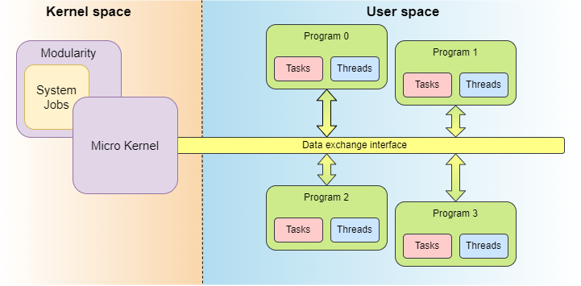

Architecture
===============================================================================================================================
- CosmOS architecture is microkernel-based and implements a near-minimum amount of the operating system's software.
- The main parts of the CosmOS microkernel is scheduling, memory handling, and data exchange interface. The data exchange interface is the operating system's basic inter-program communication model. The microkernel can be easily expanded either with system jobs if it is necessary and make the microkernel modular, even though is highly suggested to implement all services in the user space and use data exchange interface for the inter-program communication as it is shown in the figure below.
- The programs are running in the user space and each of them encapsulates its threads and tasks, providing them a safe memory space for the data, and heap for the dynamic allocation. This design allows users to implement programs with multiple safety levels without any interference between them.
- To ensure memory safety, the operating system configuration is completely static that includes also configured programs, tasks, and threads and remains constant during the run-time.

