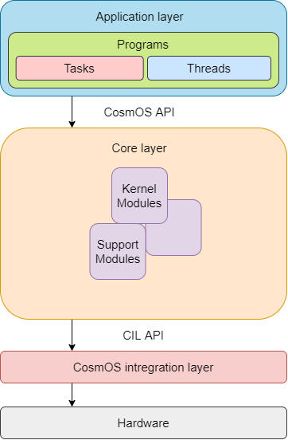

Software layers
=============================

CosmOS is composed of three main layers:
------------------------------------------
- The application layer contains the user code
- The core layer contains kernel modules without any microcontroller or compiler dependencies
- The integration layer contains units providing APIs for the core layer, and it is microcontroller specific

Application layer
------------------
The application layer is an abstraction layer where the user software is implemented.
User software in this layer is running in unprivileged mode. Therefore, it is necessary to use the CosmOS API to interact with some of the kernel modules.
The application layer consists of programs,  threads, and tasks, but sometimes in rare cases, it can also contain some handlers called in operating
system hooks. In the C/C++ language terminology, the application layer consists of the generated source and header file pairs which represent programs.
Tasks, threads, or hooks are represented as function handlers with configured names of the task, threads, or hooks via the CosmOS CustomBox.
Comments encapsulating parts that the user can change and are not deleted during the re-generation of the programs are placed in the program source files.

Core layer
------------------
The core layer was designed with a focus on the minimal compiler and microcontroller dependencies.
A set of required APIs was created to interface with peripherals and must be implemented during the microcontroller integration process
in the CosmOS integration layer (CIL).
The core layer contains multiple kernels and support modules (e.g., operating system runtime specific dynamic allocation implementations),
which consist of smaller parts called units. With this structure, we can test all units separately with unit tests. The core units are composed
from configuration and implementation parts. Unit configuration parts are generated by the CosmOS CustomBox.

Integration layer
------------------
The CosmOS integration layer alias CIL is a type of microcontroller abstraction layer. CIL provides a set of APIs required by the CosmOS core layer.
