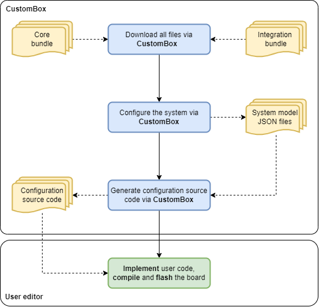

Workflow
=============================

In the figure below is shown the workflow diagram of the CosmOS. CustomBox tool helps with most of the configuration steps.

#. First, user has to choose and download the integration and core bundle. These bundles contains all necessary non-generated source code.

#. Later user configures the operating system modules and creates the programs, tasks and threads. After the configuration is completed, user can generate the configuration source code.

#. The last step is to implement user code, compile and flash the board.

