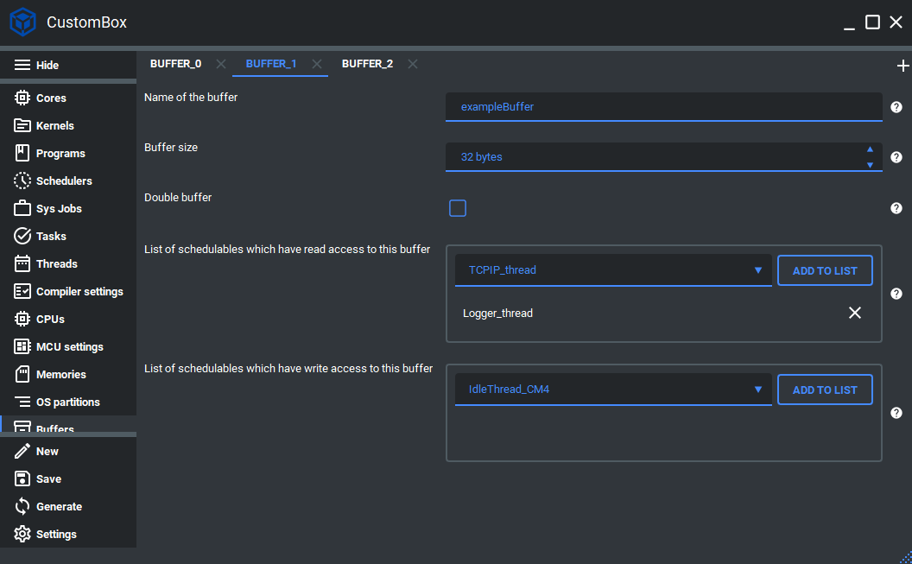

Buffer
=============================

The buffer module is the part of CosmOS data exchange interface. It is mainly
used for the inter-program critical tasks communication, but not constrained to
that. Threads can also use buffer interface but we strongly suggest to use channels
to increase overall performance of the system. For more information please read the buffer section in the :ref:`about_whitepaper`.

Configuration
--------------
1. Open the CustomBox
```````````````````````
Then we have to open from the left panel Buffers tab to see all configured buffer elements in the system as it is shown in the picture below.



2. Configure or add new buffer
````````````````````````````````
- Name of the buffer is set to exampleBuffer, this is the name of the buffer which will be used to generate buffer identifier used in the buffer read and write operations.
- Buffer size is set to 32 Bytes, this parameter defines the size of the buffer array mapped in the operating system memory.
- Double buffer checkbox is not checked, this parameter will instead of one buffer generate double buffer.
- List of schedulables which have read access to this buffer contains Logger_thread which means that this thread can read from this buffer.
- List of schedulables which have write access to this buffer contains Logger_thread which means that no schedulable is able to write to this buffer, if we want to add for instance IdleThread_CM4 we just click on **add to list** button.

3. Generate
```````````````
After we click on the **Generate** button in the CustomBox left panel on the bottom, the buffer configuration
code is generated and we can use it in the application layer. The code examples of read and write operations are shown in the next section.

Code examples
--------------

Buffer read
```````````````
.. collapse:: Click to see function buffer_readArray details

    .. doxygenfunction:: buffer_readArray

.. code-block:: C

    #include <buffer.h>
    #include <errorHandler.h>

    CosmOS_BufferStateType bufferState;

    int exampleBufferRead[10];
    bufferState = buffer_readArray( exampleBuffer_id,
        &exampleBufferRead, sizeof( exampleBufferRead ) );

    if( errorHandler_isError( bufferState ) )
    {
        //error was returned, check its value
    }

Return values
"""""""""""""""
.. collapse:: Click to see return values

    .. doxygenenum:: CosmOS_BufferStateType
        :no-link:

Buffer write
```````````````
.. collapse:: Click to see function buffer_writeArray details

    .. doxygenfunction:: buffer_writeArray

.. code-block:: C

    #include <buffer.h>
    #include <errorHandler.h>

    CosmOS_BufferStateType bufferState;

    int exampleBufferWrite = 100;
    bufferState = buffer_writeArray( exampleBuffer_id,
        &exampleBufferWrite, sizeof( exampleBufferWrite ) );

    if( errorHandler_isError( bufferState ) )
    {
        //error was returned, check its value
    }

Return values
"""""""""""""""
.. collapse:: Click to see return values

    .. doxygenenum:: CosmOS_BufferStateType
        :no-link:
