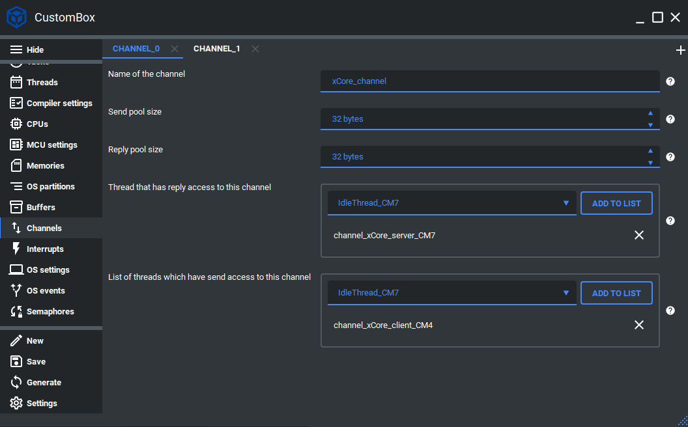

Channel
=============================

The channel module is the part of CosmOS data exchange interface. It can be
only used for the inter-program thread communication.
The simplified concept of the channel is the interface for the synchronized data
transfer between sender (can be imagined as a client) and reply (can be imagined
as a server) thread. Channel implementation currently supports data transfer from
multiple sender threads to one reply thread. For more information please read the channel section in the CosmOS whitepaper.

Configuration
--------------
1. Open the CustomBox
```````````````````````
Then we have to open from the left panel Channels tab to see all configured channel elements in the system as it is shown in the picture below.



2. Configure or add new channel
``````````````````````````````````
- Name of the channel is set to xCore_channel, this is the name of the channel which will be used to generate channel identifier used in for the channel read and write operations.
- Send pool size is set to 32 Bytes, this parameter defines the size of send pool array mapped in the operating system memory that is used during send operation.
- Reply pool size is set to 32 Bytes, this parameter defines the size of reply pool array mapped in the operating system memory that is used during reply operation.
- List of threads which have reply access to this channel contains channel_xCore_server_CM7 which means that this thread is reply (server) thread for this channel.
- List of threads which have send access to this channel contains channel_xCore_client_CM4 which means that this thread is send (client) thread for this channel, if we want to add for instance IdleThread_CM7 we just click on **add to list** button.

3. Generate
```````````````
After we click on the **Generate** button in the CustomBox left panel on the bottom, the channel configuration
code is generated and we can use it in the application layer. The code examples of send and reply operations are shown in the next section.

Code examples
--------------

Channel send thread
```````````````````````

.. code-block:: C

    #include <channel.h>
    #include <errorHandler.h>

    CosmOS_ChannelStateType channelState;

    unsigned char replyPool[32] = {0};
    unsigned char sendPool[] = "request";

    for(;;)
    {
        channelState = channel_send( xCore_channel_id,
                                    (AddressType *)sendPool,
                                    sizeof(sendPool),
                                    (AddressType *)replyPool,
                                    sizeof(replyPool));

        if( errorHandler_isError( channelState ) )
        {
            //error was returned, check its value
        }

        if( errorHandler_isError( sleepState ) )
        {
            //error was returned, check its value
        }

    }


Channel reply thread
```````````````````````

.. code-block:: C

    #include <channel.h>
    #include <errorHandler.h>

    CosmOS_ChannelStateType channelState;

    unsigned char receivePool[32] = {0};
    unsigned char replyPool[] = "reply";

    channelState = channel_initialize( xCore_channel_id );
    if( errorHandler_isError( channelState ) )
    {
        //error was returned, check its value
    }

    for(;;)
    {
        channelState = channel_receive( xCore_channel_id,
                                    (AddressType *)receivePool,
                                    sizeof(receivePool) );

        if( errorHandler_isError( channelState ) )
        {
            //error was returned, check its value
        }

        channelState = channel_reply( xCore_channel_id,
                                    (AddressType *)replyPool,
                                    sizeof(replyPool) );

        if( errorHandler_isError( channelState ) )
        {
            //error was returned, check its value
        }

    }
