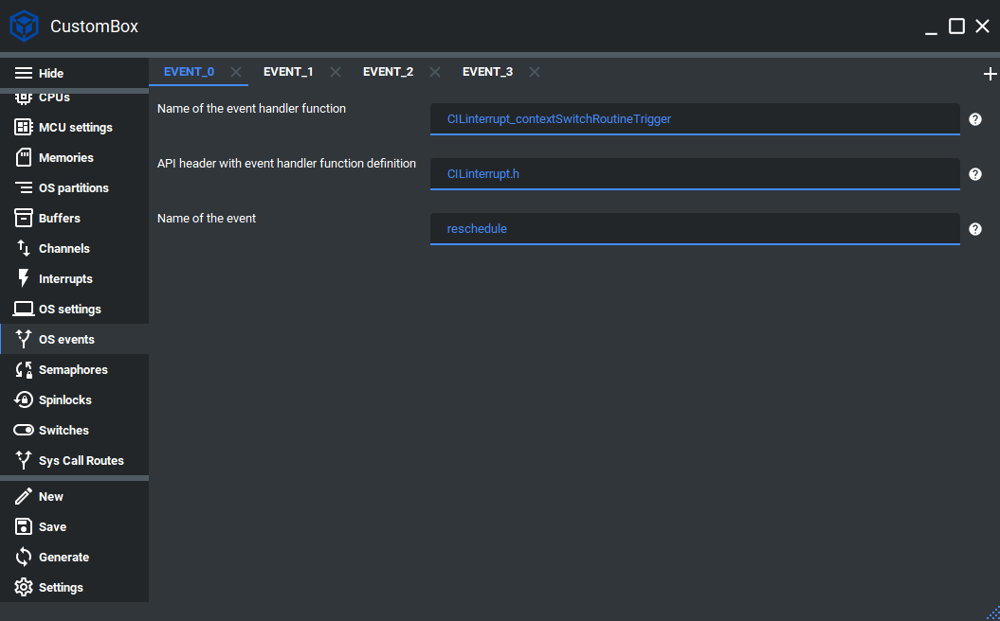

Event
=============================
The operating system event unit handles the triggering and dispatching of the
events within the operating system.
The main idea of the operating system events is to be able to trigger event from
one core and handle it with the others.
For more information please read the event section in the :ref:`about_whitepaper`.

Configuration
--------------
1. Open the CustomBox
```````````````````````
Then we have to open from the left panel Events tab to see all configured event elements in the system as it is shown in the picture below.



2. Configure or add new event
````````````````````````````````````
- Name of the event handler function is set to CILinterrupt_contextSwitchRoutineTrigger, this function will be called by the event dispatcher on the required cores.
- API header with event handler function definition is set to CILinterrupt.h, this is the header file that contains the function declaration.
- Name of the event is set to reschedule, this is the name of the event which will be used to generate event identifier macro.

3. Generate
```````````````
After we click on the **Generate** button in the CustomBox left panel on the bottom, the event configuration
code is generated and we can use it in the application layer. The code examples of event usage are shown in the next section.

Code examples
--------------

Event trigger on every other core
```````````````````````````````````
For OS event trigger operation the function :cpp:func:`osEvent_triggerEvent` was implemented.

.. doxygenfunction:: osEvent_triggerEvent
    :outline:
    :no-link:

.. code-block:: C

    #include <os.h>
    #include <event.h>
    #include <errorHandler.h>

    BitWidthType yourEvent;
    CosmOS_OsEventStateType osEventState;

    CosmOS_OsConfigurationType * osCfg;

    osCfg = os_getOsCfg();

    CosmOS_BooleanType osEventHandleCore[osCfg->numberOfCores];

    for ( BitWidthType coreIt = 0; coreIt < osCfg->numberOfCores; coreIt++ )
    {
        osEventHandleCore[coreIt] = True;
    }

    yourEvent = 100;

    osEventState = osEvent_triggerEvent(
        OS_EVENT_YOUR_EVENT_CONFIGURED_IN_CUSTOMBOX,
        osEventHandleCore,
        (AddressType *)&yourEvent,
        sizeof( yourEvent ) );

    if( errorHandler_isError( osEventState ) )
    {
        //error was returned, check its value
    }

Return values
"""""""""""""""
:cpp:enum:`CosmOS_OsEventStateType`
