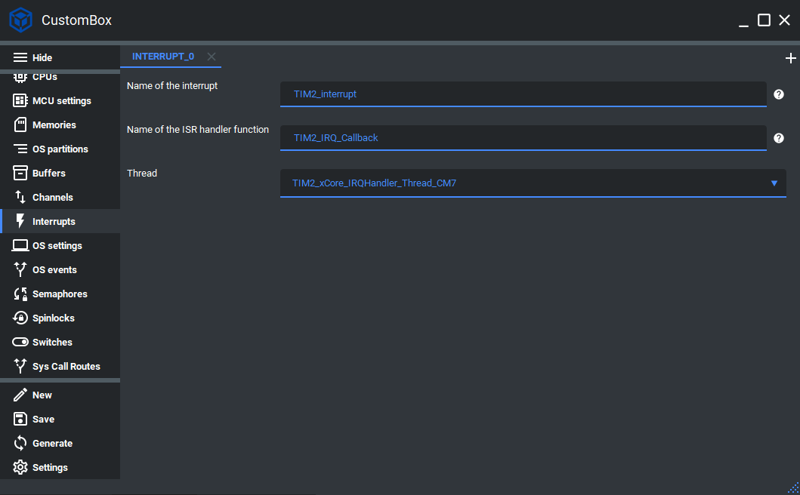

Interrupt
=============================
The interrupt module is dedicated to configure and dispatch all interrupts in the
system. In the CosmOS we differentiate between two types of interrupts handling
techniques - fast and slow.
The fast interrupt is a method where the interrupt is handled directly in the Interrupt
Service Routine (ISR). This allows users to handle the
most critical interrupts immediately, and it the interrupt service routine execution
time should be very low.
The slow interrupt is a method where the interrupt is handled in its specific thread.
The thread is unblocked after the interrupt occurs and blocked again when it is handled.
This allows users to create non-blocking interrupt handling directly in the user space for non-critical interrupts and therefore
it is possible to implement much more complex algorithms inside the handling thread.
We still suggest keeping the handler thread algorithm complexity at the minimum.
For more information please read the interrupt section in the :ref:`about_whitepaper`.

Configuration
--------------
1. Open the CustomBox
```````````````````````
Then we have to open from the left panel Interrupts tab to see all configured interrupt elements in the system as it is shown in the picture below.



2. Configure or add new interrupt
````````````````````````````````````
- Name of the interrupt is set to TIM2_interrupt, this is the name of the interrupt which will be used to generate interrupt identifier macro.
- Name of the ISR handler function is set to TIM2_IRQ_Callback, this function will be generated in the interrupt configuration unit and will unblock the interrupt handler thread.
- Thread is set to TIM2_xCore_IRQHandler_Thread CM7, this thread can call the interrupt handle function and will be unblock if the interrupt occurs.


3. Generate
```````````````
After we click on the **Generate** button in the CustomBox left panel on the bottom, the interrupt configuration
code is generated and we can use it in the application layer. The code examples of interrupt usage are shown in the next section.

Code examples
--------------

Interrupt thread
```````````````````````````````````

For interrupt handle operation the function :cpp:func:`interrupt_handle` was implemented.

.. doxygenfunction:: interrupt_handle
    :outline:
    :no-link:

.. code-block:: C

    #include <interrupt.h>
    #include <errorHandler.h>

    CosmOS_InterruptStateType interruptState;

    for ( ;; )
    {
        interruptState = interrupt_handle( TIM2_interrupt_id );
        if( errorHandler_isError( interruptState ) )
        {
            //error was returned, check its value
        }
        else
        {
            //process interrupt
        }
    }

Return values
"""""""""""""""
:cpp:enum:`CosmOS_InterruptStateType`
