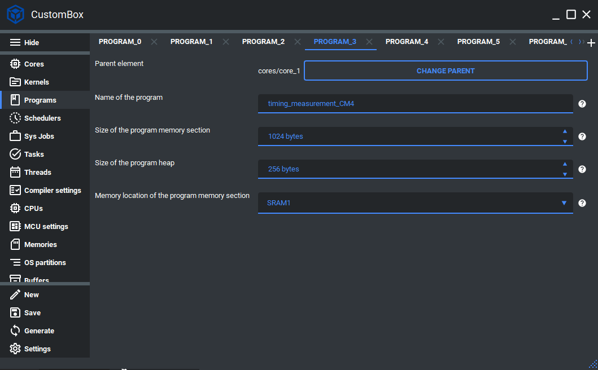

Dynamic allocation
=============================

Dynamic memory allocation and deallocation functions used in the C++ new/delete operators used after operating system start-up are implemented within the support CosmOS standard library.
These support malloc and free functions use standard kernel modules API interfaces to get the necessary information about the program in execution and its heap.
Heap memory for each program has its mutex generated by the OS for a specific program data memory for the allocation and de-allocation operations.
For more information please read the dynamic allocations section in the CosmOS whitepaper.


Configuration
--------------
1. Open the CustomBox
```````````````````````
We have to open from the left panel Programs tab to see all configured program elements in the system as it is shown in the picture below.



6. Configure heap size
`````````````````````````
- Size of the program heap is set to 256 bytes, this parameter defines the size of program memory heap.

Code examples
--------------
In the picture below we can see the heap subsection in the program memory and its growth. The heap is
placed above the uninitialized data, currently our implementation of the dynamic allocation checks if
the heap will overflow but we decided to place heap growing in the read-only protected memory direction
to trigger the memory manage fault in case it would overflow.

.. image:: ../../../images/demos/program_mapping.png

Usage of new and delete operator
`````````````````````````````````
The new and delete operators can be used after operating system start-up in any of thread type schedulable.

.. code-block:: C

    int * integerPointer = new int( 100 );

    if( IS_NOT( integerPointer ) )
    {
        delete integerPointer;
    }
    else
    {
        //not allocated
    }
