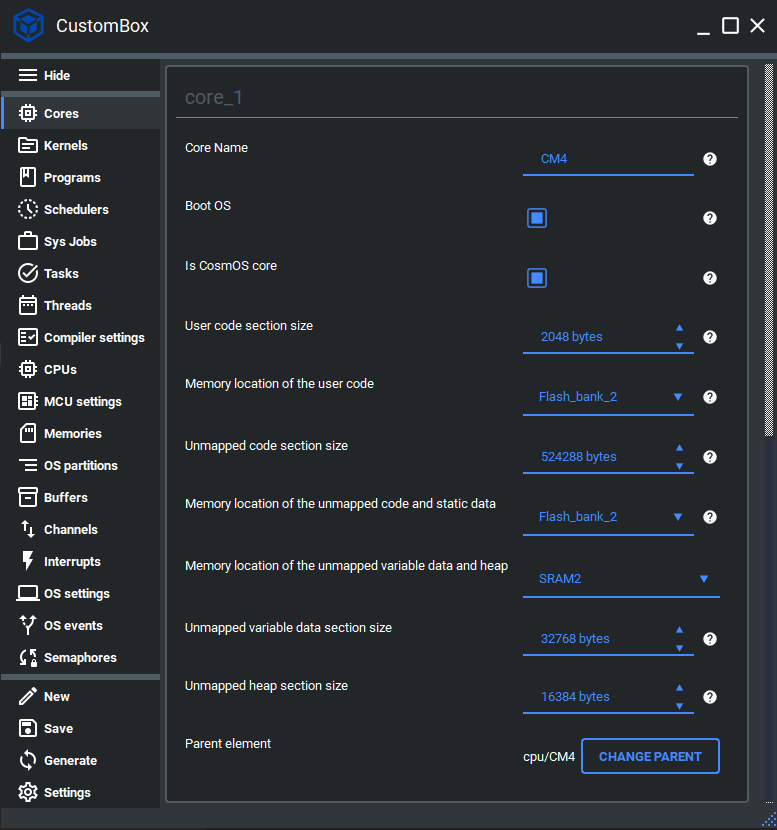
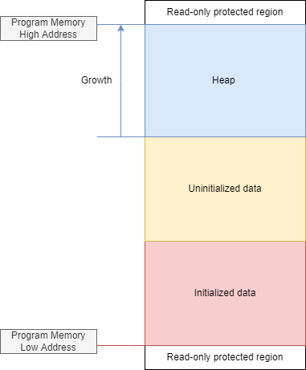

Mapping
=============================

The memory mapping unit is dedicated to mapping all application, core, and
in- integration layer sections to the physical memories. For this purpose, memory
mapping macros and the linker scripts are generated to ease the mapping of all
sections. All memory mapping is done automatically based on the system configuration if the
compiler supports the section pragmas, if not the user added data and functions in the application
layer must be mapped manually. We will cover these in the code examples.
For more information please read the memory mapping section in the :ref:`about_whitepaper`.

Configuration
--------------
1. Open the CustomBox
```````````````````````
Then we have to open from the left panel Memories tab to see all configured memory elements in the system as it is shown in the picture below. We can map
later memory section to all configured physical memories (constrained only by the CPU access).


2. Configure or add memories
`````````````````````````````
- Memory is set to DTCM, this is the name of the of the actual physical memory on our microcontroller and will be used during the linker script generation process and generation of memory mapping macros.
- Size of the memory is set to 0x20000, this parameter defines the actual size of the physical memory.
- Starting address of this memori is set to 0x20000000, this parameter defines the actual starting address of the physical memory.
- CPU access is set to the CM7, this parameter defines which cores has access to this physical memory.

3. Open the Cores tab
```````````````````````
We have to open from the left panel Cores tab to see all configured core elements in the system as it is shown in the picture below.



4. Configure core memory sections
````````````````````````````````````
- User code section size is set to 2048 bytes, this parameter defines the size of the application (user) code section.
- Memory location of the user code is set to the Flash bank 2 which is the CM4 local flash memory, this parameter defines physical memory where is the application code section mapped.
- Unmapped code section size is set to 524288 bytes, this parameter defines the size of the unmapped code section.
- Memory location of the unmapped code and static data is set to the Flash bank 2 which is the CM4 local flash memory, this parameter defines physical memory where is the unmapped code and static data section mapped.
- Memory location of the unmapped variable and heap is set to the SRAM2, this parameter defines physical memory where is the unmapped variable data and heap section mapped.
- Unmapped variable data section size is set to 32768 bytes, this parameter defines the size of the unmapped variable data section.
- Unmapped heap section size is set to 16384 bytes, this parameter defines the size of the unmapped heap section.

5. Open the Programs tab
````````````````````````````
We have to open from the left panel Programs tab to see all configured program elements in the system as it is shown in the picture below.

.. image:: ../../../images/demos/program.png

6. Configure program memory sections
``````````````````````````````````````````
- Size of the program memory section is set to 1024 bytes, this parameter defines the size of program memory section that consists of the heap and data parts (initialized and uninitialized).
- Size of the program heap is set to 256 bytes, this parameter defines the size of program memory heap.
- Memory location of the program memory section is set to the SRAM1, this parameter defines physical memory where is the program section mapped.

7. Generate
```````````````
After we click on the **Generate** button in the CustomBox left panel on the bottom, the memory mapping
code is generated and we can use it in the application layer. The code examples of mapping the user data and functions
if our compiler does not support the section pragmas are shown in the next section.

Code examples
--------------
As aforementioned, we will cover in these examples mapping of the user data and functions
if our compiler does not support the section pragmas. We will cover mapping of the initialized,
uninitialized data and the functions (code). In the picture below we can see the program data memory section
that contains uninitialized and initialized subsections.



Uninitialized data
```````````````````````
To program uninitialized data subsection we map all the data that are set to default (0) value
after the operating system boot.

.. code-block:: C

    /* @cond S */
    __SEC_START( __TIMING_MEASUREMENT_CM4_NOINIT_SECTION_START)
    /* @endcond*/
    // If your compiler does not support pragmas use __TIMING_MEASUREMENT_CM4_NOINIT_SECTION
    /********************************************************************************
    ** DO NOT MODIFY THIS COMMENT !                      USER SECTION | Start      **
    ** start_name =timing_measurement_CM4_noInit
    ********************************************************************************/
    CosmOS_MutexVariableType resourcesMutex
        __TIMING_MEASUREMENT_CM4_NOINIT_SECTION_START;
    /********************************************************************************
    ** stop_name =timing_measurement_CM4_noInit
    ** DO NOT MODIFY THIS COMMENT !                      USER SECTION | Stop       **
    ********************************************************************************/
    /* @cond S */
    __SEC_STOP( __TIMING_MEASUREMENT_CM4_NOINIT_SECTION_STOP)
    /* @endcond*/


Initialized data
````````````````````
To program initialized data subsection we map all the data that should be loaded to the
volatile memory with the predefined value.

.. code-block:: C

    /* @cond S */
    __SEC_START( __TIMING_MEASUREMENT_CM4_INIT_SECTION_START)
    /* @endcond*/
    // If your compiler does not support pragmas use __TIMING_MEASUREMENT_CM4_INIT_SECTION
    /********************************************************************************
    ** DO NOT MODIFY THIS COMMENT !                      USER SECTION | Start      **
    ** start_name =timing_measurement_CM4_init
    ********************************************************************************/
    char __TIMING_MEASUREMENT_CM4_INIT_SECTION threadMessage[] =
        "\nMutex_test_thread_CM4 released mutex for resources \r\n\n";
    /********************************************************************************
    ** stop_name =timing_measurement_CM4_init
    ** DO NOT MODIFY THIS COMMENT !                      USER SECTION | Stop       **
    ********************************************************************************/
    /* @cond S */
    __SEC_STOP( __TIMING_MEASUREMENT_CM4_INIT_SECTION_STOP)
    /* @endcond*/

Functions
`````````````
To application memory section we map all functions. For the performance optimization
we should map it to the core local memory that calls the function the most.

.. code-block:: C

    /* @cond S */
    __SEC_START( __APPLICATION_FUNC_SECTION_START_CM4 )
    /* @endcond*/
    // If your compiler does not support pragmas use __APPLICATION_FUNC_SECTION_CM4
    /********************************************************************************
    ** DO NOT MODIFY THIS COMMENT ! Code                 USER SECTION | Start      **
    ** start_name =timing_measurement_CM4_userCodeFree
    ********************************************************************************/
    __APPLICATION_FUNC_SECTION_CM4 void
    GPIO::togglePin( BitWidthType pinNumber )
    {
        HAL_GPIO_TogglePin( (GPIO_TypeDef*)address, pinNumber );
    }
    /********************************************************************************
    ** stop_name =timing_measurement_CM4_userCodeFree
    ** DO NOT MODIFY THIS COMMENT ! Code                 USER SECTION | Stop       **
    ********************************************************************************/
    /* @cond S */
    __SEC_STOP( __APPLICATION_FUNC_SECTION_STOP_CM4 )
    /* @endcond*/
