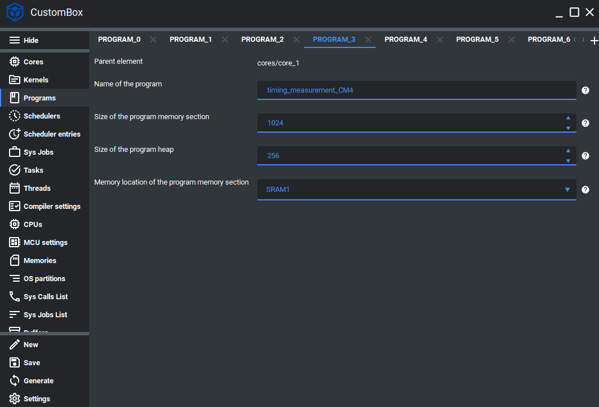

Program
=============================

.. toctree::
    :hidden:

    program/task
    program/thread


Programs consist of the :ref:`demo_task` and :ref:`demo_thread` and the user can easily assign them to
the desired program.
All programs are running in the user space and each of them encapsulates its
threads and tasks, providing them a safe program memory section for the data and heap for the
static and dynamic allocation (within the program). This design provides to user possibility
to implement programs with multiple safety levels without any interference.
To ensure memory safety the operating system configuration is completely static
that includes also configured programs, tasks and threads and remain constant during the run-time.
For more information please read the program section in the :ref:`about_whitepaper`.

Configuration
--------------
1. Open the CustomBox
```````````````````````
Then we have to open from the left panel Programs tab to see all configured program elements in the system as it is shown in the picture below.



2. Configure or add new program
````````````````````````````````
- Name of the program is set to timing_measurement_CM4, this is the name of the program which will be used to generate program source and header files and program identifier.
- Size of the program memory section is set to 1024 bytes, this parameter defines the size of program memory section that consists of the heap and data parts (initialized and uninitialized).
- Size of the program heap is set to 256 bytes, this parameter defines the size of program memory heap.
- Memory location of the program memory section is set to the SRAM1, this parameter defines physical memory where is the program section mapped.

3. Generate
```````````````
After we click on the **Generate** button in the CustomBox left panel on the bottom, the program configuration
code is generated together with the source and header file in the application layer which consist of the task and thread handlers assigned to the current program.

Code examples
--------------

Program source file
`````````````````````
- Is generated, but contains sections for the user code which are not overwritten during the generation process listed below:
    #. Include Files
    #. Declarations
    #. No init section with name based on the program -  timing_measurement_CM4_noInit
    #. Init section with name based on the program -  timing_measurement_CM4_init
    #. Every task has its own user section
    #. Every thread has its own user section
    #. Code that can be used for user function implementation

- Includes the program memory header.
- Contains task and thread handler extern declarations.
- Contains task and thread handler definitions.

.. code-block:: C

    /********************************************************************************
    **                                                                             **
    **                       GENERATED FILE BY CosmOS CustomBox                    **
    **                                                                             **
    *********************************************************************************
    **                       DOXYGEN DOCUMENTATION INFORMATION                     **
    *****************************************************************************//**
    ** @file timing_measurement_CM4.cpp
    *********************************************************************************
    <!--                           Version Information                            -->
    *********************************************************************************
    ** @version 2.0.0
    ** @author Generated by CosmOS CustomBox
    *********************************************************************************
    <!--                                 Warnings                                 -->
    *********************************************************************************
    ** @warning Modifying user sections comments can lead to removing user code
    **          during generating of the new CosmOS configuration
    ********************************************************************************/
    #include "timing_measurement_CM4.h"
    /********************************************************************************
    ** DO NOT MODIFY THIS COMMENT ! Include Files        USER SECTION | Start      **
    ** start_name =timing_measurement_CM4_includeFiles
    ********************************************************************************/

    /********************************************************************************
    ** stop_name =timing_measurement_CM4_includeFiles
    ** DO NOT MODIFY THIS COMMENT ! Include Files        USER SECTION | Stop       **
    ********************************************************************************/
    /********************************************************************************
    ** DO NOT MODIFY THIS COMMENT ! Declarations         USER SECTION | Start      **
    ** start_name =timing_measurement_CM4_userFreeDeclarations
    ********************************************************************************/

    /********************************************************************************
    ** stop_name =timing_measurement_CM4_userFreeDeclarations
    ** DO NOT MODIFY THIS COMMENT ! Declarations         USER SECTION | Stop       **
    ********************************************************************************/
    /********************************************************************************
    **                         Function Prototypes | Start                         **
    ********************************************************************************/
    /* Task in the program timing_measurement_CM4 */
    extern "C" void
    Timing_measurement_task_CM4( void );

    /* Threads in the program timing_measurement_CM4 */
    extern "C" void
    Synchronization_and_dynamicAllocation_test_thread_CM4( void );
    extern "C" void
    Synchronization_test_thread_CM4( void );
    /********************************************************************************
    **                         Function Prototypes | Stop                          **
    ********************************************************************************/
    /********************************************************************************
    **                           START OF THE SOURCE FILE                          **
    ********************************************************************************/
    /* @cond S */
    __SEC_START( __TIMING_MEASUREMENT_CM4_NOINIT_SECTION_START)
    /* @endcond*/
    // If your compiler does not support pragmas use __TIMING_MEASUREMENT_CM4_NOINIT_SECTION
    /********************************************************************************
    ** DO NOT MODIFY THIS COMMENT !                      USER SECTION | Start      **
    ** start_name =timing_measurement_CM4_noInit
    ********************************************************************************/

    /********************************************************************************
    ** stop_name =timing_measurement_CM4_noInit
    ** DO NOT MODIFY THIS COMMENT !                      USER SECTION | Stop       **
    ********************************************************************************/
    /* @cond S */
    __SEC_STOP( __TIMING_MEASUREMENT_CM4_NOINIT_SECTION_STOP)
    /* @endcond*/

    /* @cond S */
    __SEC_START( __TIMING_MEASUREMENT_CM4_INIT_SECTION_START)
    /* @endcond*/
    // If your compiler does not support pragmas use __TIMING_MEASUREMENT_CM4_INIT_SECTION
    /********************************************************************************
    ** DO NOT MODIFY THIS COMMENT !                      USER SECTION | Start      **
    ** start_name =timing_measurement_CM4_init
    ********************************************************************************/

    /********************************************************************************
    ** stop_name =timing_measurement_CM4_init
    ** DO NOT MODIFY THIS COMMENT !                      USER SECTION | Stop       **
    ********************************************************************************/
    /* @cond S */
    __SEC_STOP( __TIMING_MEASUREMENT_CM4_INIT_SECTION_STOP)
    /* @endcond*/

    /********************************************************************************
    ** Task ID macro = TASK_0_PROGRAM_1_CORE_1_ID
    ** Program ID macro = PROGRAM_1_CORE_1_ID
    ** WCET of the task in microseconds = 500.0
    ** Period of the task in milliseconds = 5.0
    ********************************************************************************/
    /* @cond S */
    __SEC_START( __APPLICATION_FUNC_SECTION_START_CM4 )
    /* @endcond*/
    __APPLICATION_FUNC_SECTION_CM4 void
    Timing_measurement_task_CM4( void )
    {
    /********************************************************************************
    ** DO NOT MODIFY THIS COMMENT !                      USER SECTION | Start      **
    ** start_name =Timing_measurement_task_CM4
    ********************************************************************************/

    /********************************************************************************
    ** stop_name =Timing_measurement_task_CM4
    ** DO NOT MODIFY THIS COMMENT !                      USER SECTION | Stop       **
    ********************************************************************************/
    };
    /* @cond S */
    __SEC_STOP( __APPLICATION_FUNC_SECTION_STOP_CM4 )
    /* @endcond*/

    /********************************************************************************
    ** Thread ID macro = THREAD_0_PROGRAM_1_CORE_1_ID
    ** Program ID macro = PROGRAM_1_CORE_1_ID
    ********************************************************************************/
    /* @cond S */
    __SEC_START( __APPLICATION_FUNC_SECTION_START_CM4 )
    /* @endcond*/
    __APPLICATION_FUNC_SECTION_CM4 void
    Synchronization_and_dynamicAllocation_test_thread_CM4( void )
    {
    /********************************************************************************
    ** DO NOT MODIFY THIS COMMENT !                      USER SECTION | Start      **
    ** start_name =Synchronization_and_dynamicAllocation_test_thread_CM4
    ********************************************************************************/

    /********************************************************************************
    ** stop_name =Synchronization_and_dynamicAllocation_test_thread_CM4
    ** DO NOT MODIFY THIS COMMENT !                      USER SECTION | Stop       **
    ********************************************************************************/
    };
    /* @cond S */
    __SEC_STOP( __APPLICATION_FUNC_SECTION_STOP_CM4 )
    /* @endcond*/
    /********************************************************************************
    ** Thread ID macro = THREAD_1_PROGRAM_1_CORE_1_ID
    ** Program ID macro = PROGRAM_1_CORE_1_ID
    ********************************************************************************/
    /* @cond S */
    __SEC_START( __APPLICATION_FUNC_SECTION_START_CM4 )
    /* @endcond*/
    __APPLICATION_FUNC_SECTION_CM4 void
    Synchronization_test_thread_CM4( void )
    {
    /********************************************************************************
    ** DO NOT MODIFY THIS COMMENT !                      USER SECTION | Start      **
    ** start_name =Synchronization_test_thread_CM4
    ********************************************************************************/

    /********************************************************************************
    ** stop_name =Synchronization_test_thread_CM4
    ** DO NOT MODIFY THIS COMMENT !                      USER SECTION | Stop       **
    ********************************************************************************/
    };
    /* @cond S */
    __SEC_STOP( __APPLICATION_FUNC_SECTION_STOP_CM4 )
    /* @endcond*/

    /* @cond S */
    __SEC_START( __APPLICATION_FUNC_SECTION_START_CM4 )
    /* @endcond*/
    // If your compiler does not support pragmas use __APPLICATION_FUNC_SECTION_CM4
    /********************************************************************************
    ** DO NOT MODIFY THIS COMMENT ! Code                 USER SECTION | Start      **
    ** start_name =timing_measurement_CM4_userCodeFree
    ********************************************************************************/

    /********************************************************************************
    ** stop_name =timing_measurement_CM4_userCodeFree
    ** DO NOT MODIFY THIS COMMENT ! Code                 USER SECTION | Stop       **
    ********************************************************************************/
    /* @cond S */
    __SEC_STOP( __APPLICATION_FUNC_SECTION_STOP_CM4 )
    /* @endcond*/
    /********************************************************************************
    **                           END OF THE SOURCE FILE                            **
    ********************************************************************************/

Program header file
`````````````````````
- It is completely generated, but contains section for the user code which is not overwritten during the generation:
    #. Section for declaration, definition and user code -  timing_measurement_CM4

- Includes CosmOS API, types, memory mapping and system definitions.

.. code-block:: C

    /********************************************************************************
    **                                                                             **
    **                       GENERATED FILE BY CosmOS CustomBox                    **
    **                                                                             **
    *********************************************************************************
    **                       DOXYGEN DOCUMENTATION INFORMATION                     **
    *****************************************************************************//**
    ** @file timing_measurement_CM4.h
    *********************************************************************************
    <!--                           Version Information                            -->
    *********************************************************************************
    ** @version 2.0.0
    ** @author Generated by CosmOS CustomBox
    *********************************************************************************
    <!--                                 Warnings                                 -->
    *********************************************************************************
    ** @warning Modifying user sections comments can lead to removing user code
    **          during generating of the new CosmOS configuration
    ********************************************************************************/
    /********************************************************************************
    **                           START OF THE HEADER FILE                          **
    ********************************************************************************/
    #ifndef __TIMING_MEASUREMENT_CM4_H__
    #define __TIMING_MEASUREMENT_CM4_H__
    /********************************************************************************
    **                         START OF C++ SUPPORT SECTION                        **
    ********************************************************************************/
    #ifdef __cplusplus
    extern "C" {
    #endif
    /********************************************************************************
    **                            Include Files | Start                            **
    ********************************************************************************/
    #include <cosmosApi.h>
    #include <cosmosTypes.h>
    #include <memoryMapping.h>
    #include <sysDefs.h>

    /********************************************************************************
    **                            Include Files | Stop                             **
    ********************************************************************************/
    /********************************************************************************
    ** DO NOT MODIFY THIS COMMENT !                      USER SECTION | Start      **
    ** start_name =timing_measurement_CM4
    ********************************************************************************/

    /********************************************************************************
    ** stop_name =timing_measurement_CM4
    ** DO NOT MODIFY THIS COMMENT !                      USER SECTION | Stop       **
    ********************************************************************************/
    #ifdef __cplusplus
    }
    #endif
    /********************************************************************************
    **                         END OF C++ SUPPORT SECTION                          **
    ********************************************************************************/
    #endif
    /********************************************************************************
    **                           END OF THE HEADER FILE                            **
    ********************************************************************************/
