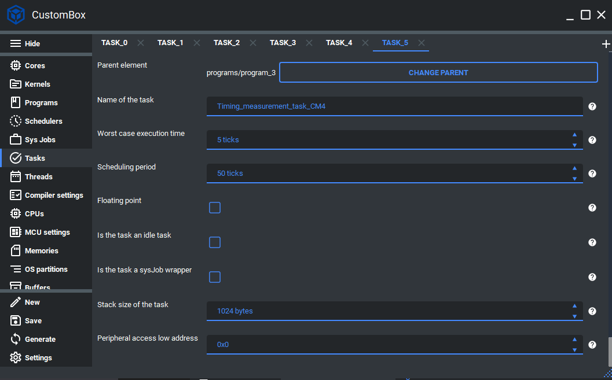

.. _demo_task:

Task
=============================
Tasks are in the application layer and can be represented, as mentioned before,
as a function handler. These functions are declared inside the schedulable kernel
module but exposed during the linking phase. Each task code is automatically
mapped to the specific application section and does not have to be explicitly mapped
to program data by the user. The tasks are generated with all necessary information
(e.g., WCET or task period) to ease the implementation phase.
For more information please read the task section in the :ref:`about_whitepaper`.

Configuration
--------------
1. Open the CustomBox
```````````````````````
Then we have to open from the left panel Task tab to see all configured task elements in the system as it is shown in the picture below.



2. Configure or add new task
````````````````````````````````
- Name of the task is set to Timing_measurement_task_CM4, this is the name of the task which will be used to generate task handler function and task identifier.
- Worst case execution time is set to 5 ticks, this parameter defines what is the worst case execution time for the current task and if it exceeds the task is terminated and the error reaction is triggered. Currently the WCET is using tick as its unit but it will be upgraded in the future.
- Scheduling period is set to 50 ticks, this parameter defines what is the cyclic period of the task. Currently the scheduling period is using tick as its unit but it will be upgraded in the future.
- Floating point checkbox is unchecked, if we want to use the hardware floating point calculations we should check the floating point checkbox.
- Is the task an idle checkbox is unchecked, if the task is configured as idle task we should check this checkbox.
- Is the task a sysJob wrapper checkbox is unchecked, if the task is configured as sysJobs wrapper we should check this checkbox.
- Stack size of the task is set to 1024, this parameter defines the stack memory section for the current task.
- Peripheral access low address is set to 0, if we want to access some peripheral we set its low address here.
- Peripheral access size is set to 0, if we want to access some peripheral we set its size here.

3. Generate
```````````````
After we click on the **Generate** button in the CustomBox left panel on the bottom, the task configuration
code is generated and the task handler is generated inside the program source file in the application layer.

Code examples
--------------

Task handler
```````````````
- Is generated within its program source file, but contains section for the user code which is not overwritten during the generation process.
- Contains basic information about the task:
    #. Task ID macro
    #. Program ID macro
    #. WCET of the task in microseconds
    #. Period of the task in milliseconds

.. code-block:: C

    /********************************************************************************
    ** Task ID macro = TASK_0_PROGRAM_1_CORE_1_ID
    ** Program ID macro = PROGRAM_1_CORE_1_ID
    ** WCET of the task in microseconds = 500.0
    ** Period of the task in milliseconds = 5.0
    ********************************************************************************/
    /* @cond S */
    __SEC_START( __APPLICATION_FUNC_SECTION_START_CM4 )
    /* @endcond*/
    __APPLICATION_FUNC_SECTION_CM4 void
    Timing_measurement_task_CM4( void )
    {
    /********************************************************************************
    ** DO NOT MODIFY THIS COMMENT !                      USER SECTION | Start      **
    ** start_name =Timing_measurement_task_CM4
    ********************************************************************************/

    /********************************************************************************
    ** stop_name =Timing_measurement_task_CM4
    ** DO NOT MODIFY THIS COMMENT !                      USER SECTION | Stop       **
    ********************************************************************************/
    };
    /* @cond S */
    __SEC_STOP( __APPLICATION_FUNC_SECTION_STOP_CM4 )
    /* @endcond*/
