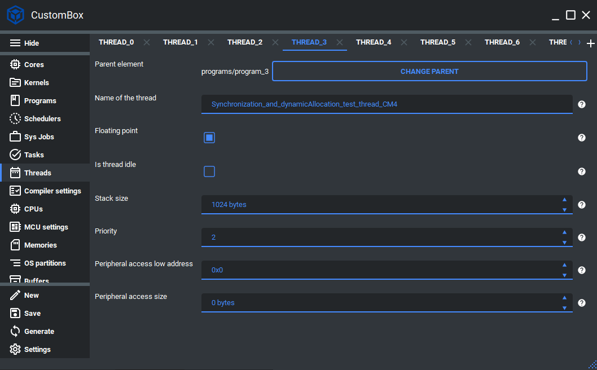

.. _demo_thread:

Thread
=============================
As mentioned before, threads are in the application layer and can be represented
as a function handler. These functions are declared inside the schedulable kernel
module but exposed during the linking phase. Each thread code is automatically
mapped to the specific application section and does not have to be explicitly mapped
to program data by the user.
For more information please read the thread section in the :ref:`about_whitepaper`.

Configuration
--------------
1. Open the CustomBox
```````````````````````
Then we have to open from the left panel Thread tab to see all configured thread elements in the system as it is shown in the picture below.



2. Configure or add new thread
````````````````````````````````
- Name of the thread is set to Synchronization_and_dynamicAllocation_test_thread_CM4, this is the name of the thread which will be used to generate thread handler function and thread identifier.
- Floating point checkbox is unchecked, if we want to use the hardware floating point calculations we should check the floating point checkbox.
- Is the thread an idle checkbox is unchecked, if the thread is configured as idle thread we should check this checkbox.
- Stack size of the thread is set to 1024, this parameter defines the stack memory section for the current thread.
- Priority is set to 2, this parameter defines the priority of the current thread, the 0 is the lowest and BitWidthType MAX is the highest.
- Peripheral access low address is set to 0, if we want to access some peripheral we set its low address here.
- Peripheral access size is set to 0, if we want to access some peripheral we set its size here.

3. Generate
```````````````
After we click on the **Generate** button in the CustomBox left panel on the bottom, the thread configuration
code is generated and the thread handler is generated inside the program source file in the application layer.

Code examples
--------------

Thread handler
```````````````
- Is generated within its program source file, but contains section for the user code which is not overwritten during the generation process.
- Contains basic information about the thread:
    #. Thread ID macro
    #. Program ID macro


.. code-block:: C

    /********************************************************************************
    ** Thread ID macro = THREAD_0_PROGRAM_1_CORE_1_ID
    ** Program ID macro = PROGRAM_1_CORE_1_ID
    ********************************************************************************/
    /* @cond S */
    __SEC_START( __APPLICATION_FUNC_SECTION_START_CM4 )
    /* @endcond*/
    __APPLICATION_FUNC_SECTION_CM4 void
    Synchronization_and_dynamicAllocation_test_thread_CM4( void )
    {
    /********************************************************************************
    ** DO NOT MODIFY THIS COMMENT !                      USER SECTION | Start      **
    ** start_name =Synchronization_and_dynamicAllocation_test_thread_CM4
    ********************************************************************************/

    /********************************************************************************
    ** stop_name =Synchronization_and_dynamicAllocation_test_thread_CM4
    ** DO NOT MODIFY THIS COMMENT !                      USER SECTION | Stop       **
    ********************************************************************************/
    };
    /* @cond S */
    __SEC_STOP( __APPLICATION_FUNC_SECTION_STOP_CM4 )
    /* @endcond*/
