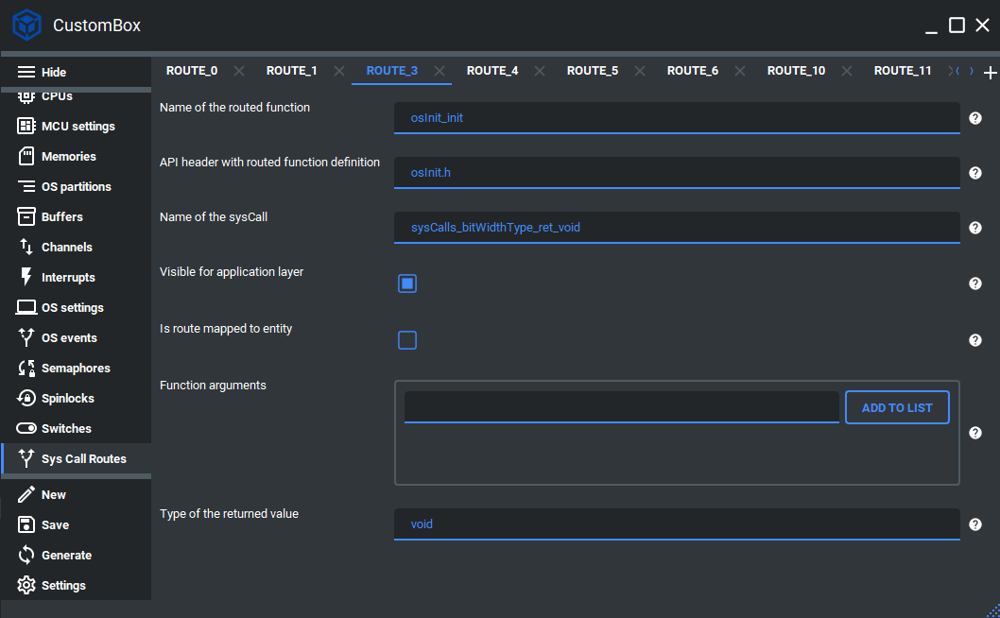

SysCall Routes
=============================
The route module is dedicated to mapping system calls to specific function handlers and entities.
Currently, the system calls are used as an interface function for passing correct arguments types. This allows us to have mapped multiple function handlers and entities
to the one system call interface function. To achieve such behavior, we need to have
a unique route identifier and retrieve the correct function and entity in the system
call dispatcher. Routes can be configured via the CosmOS CustomBox GUI in the
tab Routes by the user or system integrator if there is a need to add some specific
kernel side service.
For more information please read the route section in the :ref:`about_whitepaper`.

Configuration
--------------
1. Open the CustomBox
```````````````````````
Then we have to open from the left panel Sys Call Routes tab to see all configured route elements in the system as it is shown in the picture below.



2. Configure or add new route
````````````````````````````````````
- Name of the routed function is set to osInit_init, this function will be called by the system call dispatcher in the privileged mode.
- API header with routed function function definition is set to osInit.h, this is the header file that contains the function declaration.
- Name of the sysCall is set to sysCalls_bitWidthType_ret_void, this paramter defines the system call function used as interface that transfers the arguments to the system call dispatcher.
- Visible for application layer is checked, if it would be unchecked the function like macro would not be generated in the cosmosApi header instead it would be in cosmosApiInternal.
- Is route mapped to entity is unchecked, this parameter is used to map the system call not just to function but also to some entity for instance in the array.
- Function arguments are empty, this parameter can be used if the function needs some arguments.
- Type o the returned value is set to void as the function does not return anything, if we need to return some specific type we can specify it here.

3. Generate
```````````````
After we click on the **Generate** button in the CustomBox left panel on the bottom, the route configuration
code is generated and we can use it in the application layer. The code examples of route usage are shown in the next section.

Code examples
--------------

Cosmos API route
`````````````````````

.. code-block:: C

    #include <cosmosApi.h>

    cosmosApi_osInit_init();
