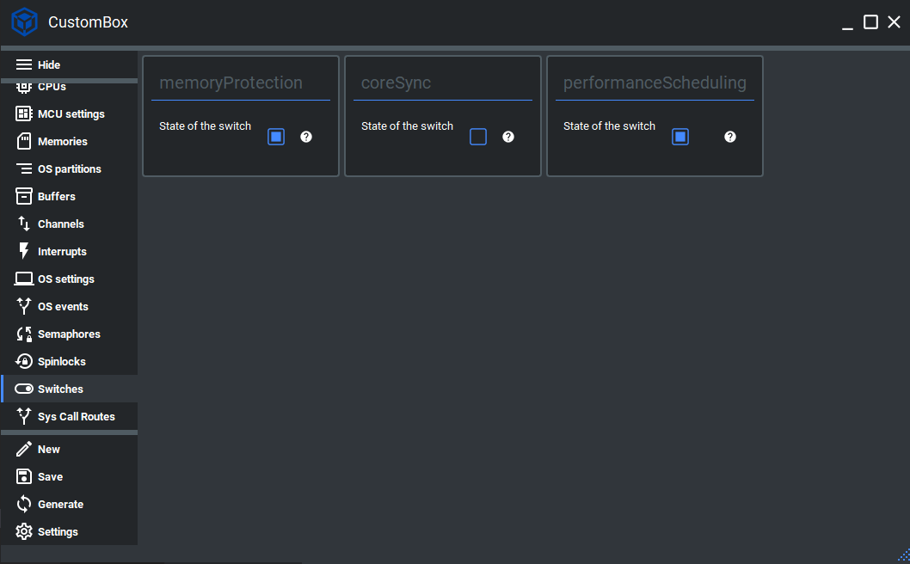

Classic
=============================

The classic scheduling algorithm handles cyclic non-preemptive critical tasks scheduling.
It uses a static schedule table generated by CustomBox.
The main idea of the classic scheduling was to reduce the number of system
timer interrupts and allow the processor to stay in some of the low power modes for
a longer time.
The main characteristics of the classic scheduling algorithm are:

- The algorithm uses the hyper period that is defined as the least common multiple of the tasks periods.
- Tasks are cyclically triggered with their period.
- Tasks use wrappers with system call that signalizes the operating system after a user code is executed.
- If the system call is not executed before the timer interrupt occurs, the safety reaction is triggered.
- The scheduler always sets timer ticks either to the WCET or the next start time

For more information please read the classic scheduling section in the :ref:`about_whitepaper`.

Configuration
--------------
1. Open the CustomBox
```````````````````````
Then we have to open from the left panel Switch tab to see all configured switch elements in the system as it is shown in the picture below.



2. Switch performance scheduling OFF
`````````````````````````````````````
- State of the switch is set to on (checked checkbox), to turn off performance scheduling we just uncheck the checkbox.

3. Generate
```````````````
After we click on the **Generate** button in the CustomBox left panel on the bottom, the scheduling switch configuration
code is generated. After switching off performance scheduling, only classic scheduling is configured in the system and no threads will
be running during the run-time.

Classic scheduling example
----------------------------
In the diagram below we can see the classic scheduling during the run-time (the performance scheduling is switched off).


