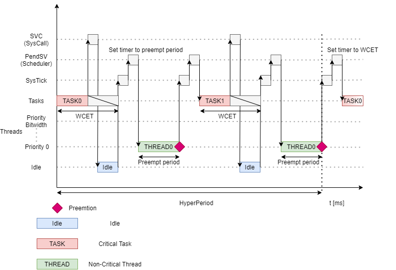

Hybrid
=============================
The hybrid scheduling algorithm consists of classic and
performance scheduling. With this combination, it is possible to schedule critical
tasks and non-critical threads within one system.
The main characteristics of the hybrid scheduling algorithm are:

- Tasks are periodically scheduled and cannot be preempted, but just terminated.
- Threads are scheduled based on their unique priority and can be preempted when one of the mentioned events in performance scheduling occurs.

For more information please read the hybrid scheduling section in the :ref:`about_whitepaper`.

Configuration
--------------
1. Open the CustomBox
```````````````````````
Then we have to open from the left panel Switch tab to see all configured switch elements in the system as it is shown in the picture below.

.. image:: ../../../images/demos/switch.png

2. Switch performance scheduling ON
`````````````````````````````````````
- State of the switch is set to on (checked checkbox), to turn on performance scheduling we just uncheck the checkbox.

2. Configure critical tasks
`````````````````````````````````````````
- When we want to use hybrid scheduling we can configure critical tasks and they will be scheduled inbetween the threads.

3. Generate
```````````````
After we click on the **Generate** button in the CustomBox left panel on the bottom, the scheduling switch configuration
code is generated. After switching on performance scheduling and reconfigured critical tasks, hybrid scheduling is
configured in the system and critical tasks with threads will be running in the system during the run-time.

Hybrid scheduling example
----------------------------
In the diagram below we can see the hybrid scheduling during the run-time (the performance scheduling is switched on and critical tasks are configured).


