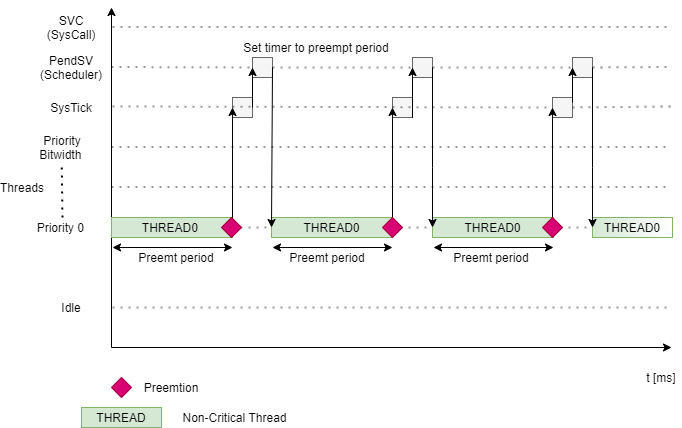

Performance
=============================

The performance scheduling algorithm handles the preemptive non-critical threads
scheduling. It uses a static non-critical thread list (priority sorted to decrease context switch execution time) to take the highest priority thread as fast as possible
each time the rescheduling event occurs. Performance scheduling algorithm also
offers blocking non-critical threads caused by multiple events, such as putting the
non-critical thread to sleep, being blocked by mutex or blocking it by the user.
The main characteristics of the performance scheduling algorithm are:

#. The algorithm iterates over non-critical thread list and schedules the next thread based on its unique priority.

#. Threads are preempted in case of:
    - System timer interrupt, with the constant preempt period.
    - User tries to obtain mutex locked by another thread.
    - User tries to obtain sempahore locked by another thread.
    - User puts them into sleep for some specific time.
    - User puts them into a blocked state.

For more information please read the performance scheduling section in the :ref:`about_whitepaper`.

Configuration
--------------
1. Open the CustomBox
```````````````````````
Then we have to open from the left panel Switch tab to see all configured switch elements in the system as it is shown in the picture below.

.. image:: ../../../images/demos/switch.png

2. Switch performance scheduling ON
`````````````````````````````````````
- State of the switch is set to on (checked checkbox), to turn on performance scheduling we just uncheck the checkbox.

2. Do not configure any critical tasks
`````````````````````````````````````````
- When we want to use only performance scheduling we can not configure critical tasks in the system. Currently only idle task for each core is necessary (will be removed in the future)

3. Generate
```````````````
After we click on the **Generate** button in the CustomBox left panel on the bottom, the scheduling switch configuration
code is generated. After switching on performance scheduling and reconfigured critical tasks, only performance scheduling is
configured in the system and no critical tasks will be running during the run-time.

Hybrid scheduling example
----------------------------
In the diagram below we can see the hybrid scheduling during the run-time (the performance scheduling is switched on and no critical tasks are configured).


