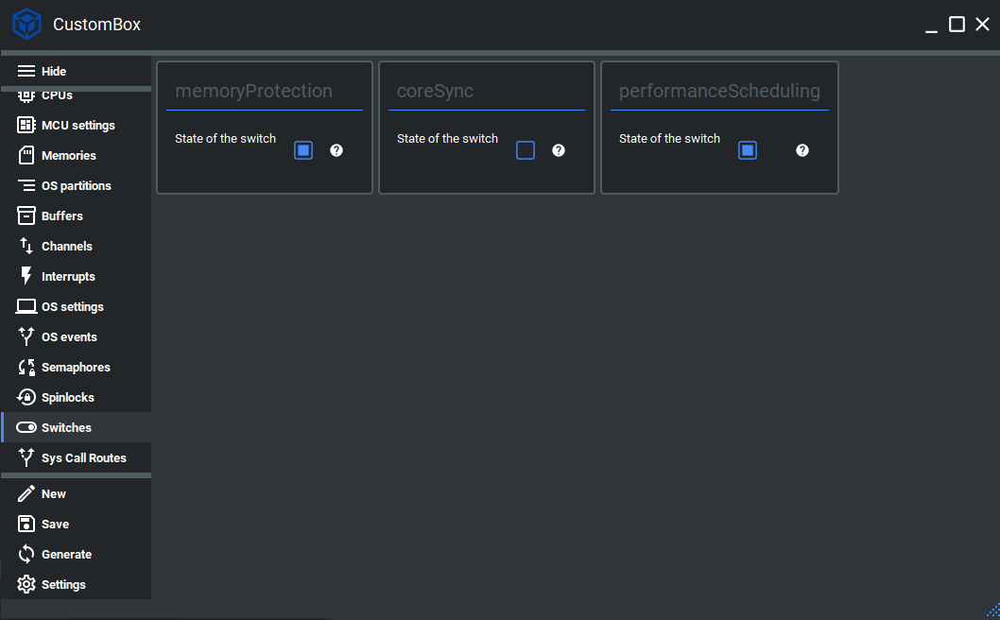

Switch
=============================

The switches module enables the user and integrator to turn on/off some of
the operating system functionalities, which might depend on hardware or are just
optional features and do not affect the operating system.
This module has one switch header file per functionality that might be turned
on/off during the system configuration. This header file provides switch macro API
which can be mapped to the real function implementations or serve as stubbed
functions. Therefore, we don't have to create macro guards around specific function
calls.

For more information please read the switches section in the :ref:`about_whitepaper`.

Configuration
--------------
1. Open the CustomBox
```````````````````````
Then we have to open from the left panel Switch tab to see all configured switch elements in the system as it is shown in the picture below.



2. Configure or add new switch
`````````````````````````````````````
- State of the switch is set to on (checked checkbox), to turn it off we just uncheck the checkbox.

.. note::  This page is planned to be completed within a **Live release**. The switch functionality will be expanded.

3. Generate
```````````````
After we click on the **Generate** button in the CustomBox left panel on the bottom, the switch configuration
code is generated.

Code examples
--------------

Performance scheduling switch
```````````````````````````````````

.. code-block:: C

    /* SCHEDULER_PERFORMANCE_SCHEDULING IS_EQUAL_TO ON */
    switchScheduler_performanceScheduling( ... );
