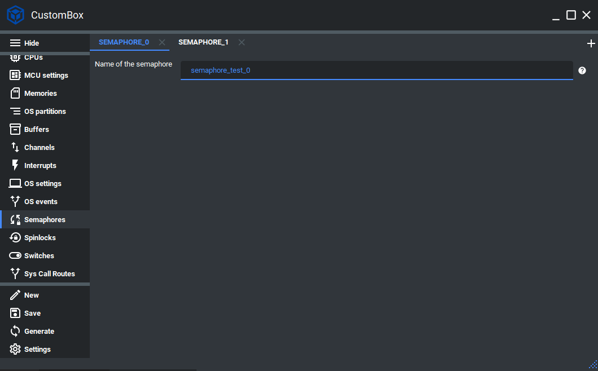

Semaphore
=============================
Semaphores are one of the synchronization primitives that are implemented in
CosmOS. A semaphore is designed to grant exclusive access to critical section to
a specific thread. The semaphore locking mechanism can be used only for threads
within the operating system instead of the mutexes which can be only used within
the program. In CosmOS, we implemented two ways of obtaining a semaphore.
One way is a non-blocking method and does not cause thread preemption in case
of unsuccessful locking of the semaphore. In case of unsuccessful locking of the
semaphore, the other way will trigger the thread preemption and unblock it after
the semaphore is unlocked again. The semaphore implementation also provides
additional protection against a deadlock.
For more information please read the semaphore section in the :ref:`about_whitepaper`.

Configuration
--------------
1. Open the CustomBox
```````````````````````
Then we have to open from the left panel Semaphores tab to see all configured semaphore elements in the system as it is shown in the picture below.



2. Configure or add new semaphore
````````````````````````````````````
- Name of the semaphore is set to semaphore_test_0, this is the name of the semaphore which will be used to generate semaphore identifier used in the semaphore get, try and release operations.

3. Generate
```````````````
After we click on the **Generate** button in the CustomBox left panel on the bottom, the semaphore configuration
code is generated and we can use it in the application layer. The code examples of semaphore usage are shown in the next section.

Code examples
--------------

Semaphore get and release
```````````````````````````
To try semaphore, the function :cpp:func:`semaphore_trySemaphore` was implemented.

.. doxygenfunction:: semaphore_trySemaphore
    :outline:
    :no-link:

To get semaphore, the function :cpp:func:`semaphore_getSemaphore` was implemented.

.. doxygenfunction:: semaphore_getSemaphore
    :outline:
    :no-link:

To release semaphore, the function :cpp:func:`semaphore_releaseSemaphore` was implemented.

.. doxygenfunction:: semaphore_releaseSemaphore
    :outline:
    :no-link:

.. code-block:: C

    #include <semaphore.h>
    #include <errorHandler.h>

    CosmOS_SemaphoreStateType semaphoreState;

    semaphoreState = semaphore_getSemaphore( semaphore_test_0_id );
    if( errorHandler_isError( semaphoreState ) )
    {
        //error was returned, check its value
    }

    //Critical code section (safe in inter-program synchronization)

    semaphoreState = semaphore_releaseSemaphore( semaphore_test_0_id );
    if( errorHandler_isError( semaphoreState ) )
    {
        //error was returned, check its value
    }

Return values
"""""""""""""""
:cpp:enum:`CosmOS_SemaphoreStateType`
