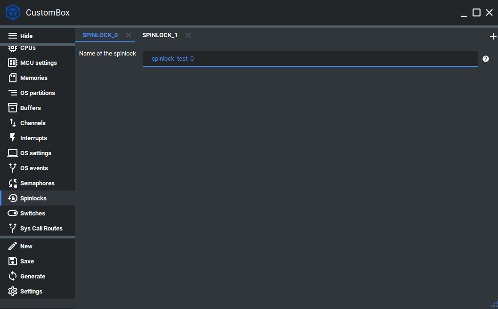

Spinlock
=============================
Spinlocks are one of the synchronization primitives that are implemented in CosmOS. A spinlock is designed to grant exclusive access to shared resources to a
specific schedulable (task/thread). The spinlock locking mechanism can be used in
task/threads within the operating system. In CosmOS, we implemented two ways
of obtaining a spinlock. One way is the non-spinning method and does not cause
spinning in the loop waiting for spinlock release in case of not successful locking of
the spinlock. In case of unsuccessful locking of the spinlock, the other way will wait
in a loop until the spinlock is unlocked again. The spinlock implementation also
provides additional protection against a deadlock.
For more information please read the spinlock section in the :ref:`about_whitepaper`.

Configuration
--------------
1. Open the CustomBox
```````````````````````
Then we have to open from the left panel Spinlock tab to see all configured spinlock elements in the system as it is shown in the picture below.



2. Configure or add new spinlock
````````````````````````````````````
- Name of the spinlock is set to spinlock_test_0, this is the name of the spinlock which will be used to generate spinlock identifier used in the spinlock get, try and release operations.

3. Generate
```````````````
After we click on the **Generate** button in the CustomBox left panel on the bottom, the spinlock configuration
code is generated and we can use it in the application layer. The code examples of spinlock usage are shown in the next section.

Code examples
--------------

Spinlock get and release
```````````````````````````
.. collapse:: Click to see function spinlock_getSpinlock details

    .. doxygenfunction:: spinlock_getSpinlock

.. collapse:: Click to see function spinlock_releaseSpinlock details

    .. doxygenfunction:: spinlock_releaseSpinlock

.. code-block:: C

    #include <spinlock.h>
    #include <errorHandler.h>

    CosmOS_SpinlockStateType spinlockState;

    spinlockState = spinlock_getSpinlock( spinlock_test_0_id );
    if( errorHandler_isError( spinlockState ) )
    {
        //error was returned, check its value
    }

    //Critical code section (safe in inter-program synchronization)

    spinlockState = spinlock_releaseSpinlock( spinlock_test_0_id );
    if( errorHandler_isError( spinlockState ) )
    {
        //error was returned, check its value
    }

.. collapse:: Click to see return values

    .. doxygenenum:: CosmOS_SpinlockStateType
        :no-link:

Spinlock try and release
```````````````````````````
To try spinlock, the function :cpp:func:`spinlock_trySpinlock` was implemented.

.. doxygenfunction:: spinlock_trySpinlock
    :outline:
    :no-link:

To get spinlock, the function :cpp:func:`spinlock_getSpinlock` was implemented.

.. doxygenfunction:: spinlock_getSpinlock
    :outline:
    :no-link:

To release spinlock, the function :cpp:func:`spinlock_releaseSpinlock` was implemented.

.. doxygenfunction:: spinlock_releaseSpinlock
    :outline:
    :no-link:

.. code-block:: C

    #include <spinlock.h>
    #include <errorHandler.h>

    CosmOS_SpinlockStateType spinlockState;

    spinlockState = spinlock_trySpinlock( spinlock_test_0_id );
    if ( spinlockState IS_EQUAL_TO SPINLOCK_STATE_ENUM__SUCCESSFULLY_LOCKED )
    {

        //Critical code section (safe in inter-program synchronization)

        spinlockState = spinlock_releaseSpinlock( spinlock_test_0_id );
    }
    else
    {
        if( errorHandler_isError( spinlockState ) )
        {
            //error was returned, check its value
        }
    }

Return values
"""""""""""""""
:cpp:enum:`CosmOS_SpinlockStateType`
