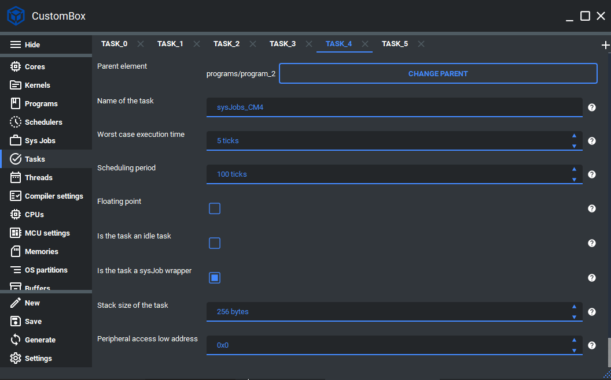

System jobs
=============================
The system jobs module allows the user to run critical software (e. g. drivers) in
the kernel space.
This module reduces otherwise necessary system calls from the user space and
decreases the execution time of the critical software.
All system job handlers (classic c language non-returning functions) run under
critical tasks and inherit all critical task properties. Still, it is possible to create
an inner period for each group of handlers within this task. The system jobs group
period is based on the system job task period. It can be multiplied by the group
period multiplier to increase the inner period for a specific system jobs group when
it does not have to be scheduled every time the system jobs task is scheduled.
For more information please read the system jobs section in the :ref:`about_whitepaper`.

Configuration
--------------
1. Open the CustomBox
```````````````````````
Then we have to open from the left panel Tasks tab to see all configured task elements in the system as it is shown in the picture below.



2. Configure or add new system job task
``````````````````````````````````````````
- Name of the task is set to sysJobs_CM4, this is the name of the task which will be used to generate task handler function and task identifier.
- Worst case execution time is set to 5 ticks, this parameter defines what is the worst case execution time for the current task and if it exceeds the task is terminated and the error reaction is triggered. Currently the WCET is using tick as its unit but it will be upgraded in the future.
- Scheduling period is set to 100 ticks, this parameter defines what is the cyclic period of the task. Currently the scheduling period is using tick as its unit but it will be upgraded in the future.
- Floating point checkbox is unchecked, if we want to use the hardware floating point calculations we should check the floating point checkbox.
- Is the task an idle checkbox is unchecked, if the task is configured as idle task we should check this checkbox.
- Is the task a sysJob wrapper checkbox is **checked**.
- Stack size of the task is set to 1024, this parameter defines the stack memory section for the current task.
- Peripheral access low address is set to 0, if we want to access some peripheral we set its low address here.
- Peripheral access size is set to 0, if we want to access some peripheral we set its size here.

5. Open the SysJobs tab
````````````````````````````
We have to open from the left panel SysJobs tab to see all configured system jobs group elements in the system as it is shown in the picture below.


2. Configure or add new system jobs group
``````````````````````````````````````````
- System job group task period multiplicator is set to multiplied by 2, this parameter defines the number that multiplies system job task scheduling period.
- System job group functions are set to sysJobsGroup_10ms_CM4 function handler, this parameter defines the list of functions called when the current system jobs group is scheduled with inner system job scheduling.
- System job group functions header files are set to default_CM4.h header file, this parameter defines the list of header files which provide the function declarations.

3. Generate
```````````````
After we click on the **Generate** button in the CustomBox left panel on the bottom, the sysJobs configuration
code is generated and all functions added to groups will be scheduled during the run-time in the kernel space.

Code examples
--------------

Sys job group function handler
`````````````````````````````````
- We suggest defining the function handlers from the system jobs group in the parent program of the system job task and mapping the function code to the program code section as it is shown in the code example below.

.. code-block:: C

    /* @cond S */
    __SEC_START( __APPLICATION_FUNC_SECTION_START_CM4 )
    /* @endcond*/
    // If your compiler does not support pragmas use __APPLICATION_FUNC_SECTION_CM4
    /********************************************************************************
    ** DO NOT MODIFY THIS COMMENT ! Code                 USER SECTION | Start      **
    ** start_name =default_CM4_userCodeFree
    ********************************************************************************/
    __APPLICATION_FUNC_SECTION_CM4 void
    sysJobsGroup_10ms_CM4( void )
    {
        HAL_GPIO_TogglePin( GPIOA, GPIO_PIN_4 );
    }
    /********************************************************************************
    ** stop_name =default_CM4_userCodeFree
    ** DO NOT MODIFY THIS COMMENT ! Code                 USER SECTION | Stop       **
    ********************************************************************************/
    /* @cond S */
    __SEC_STOP( __APPLICATION_FUNC_SECTION_STOP_CM4 )
    /* @endcond*/
