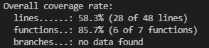

Run tests
=============================
Currently it is easy to run tests from the docker development environment. After cloning the reference
project we need to change directory to the project root and call following command from there:

.. code-block::

    cd Cosmos/build && ./build.sh -b TESTS

How to get the results and tests coverage
-------------------------------------------
Console output
`````````````````
To quickly check if your tests are passing you can use the console output. It provides to you verbose output with the
OK tag next to the passed test and overview percentage of the passed test together with number of passed tests in the end of
the test execution as it is shown in the picture below.


If we want to check the code coverage directly in the console output, it is generated in the end of the verbose output log
using the format shown in the picture below.



Generated result XML files
````````````````````````````
Generated XML test results contain the test suite name with the number of tests and the tests themselves with descriptions.
This files can be used in the continuous integration (CI) applications. The XML test results can be found in the directory:

- ``reference_project_stmIDE/Cosmos/generated/build/tests/tests/results``

The structure of the XML file is shown in the
XML snippet for the Test_core suite below.

.. code-block:: XML

    <?xml version="1.0" encoding="UTF-8"?>
    <testsuites tests="2" failures="0" disabled="0" errors="0" time="0.001" timestamp="2021-12-31T12:02:45.975" name="AllTests">
    <testsuite name="Test_core" tests="2" failures="0" disabled="0" skipped="0" errors="0" time="0" timestamp="2021-12-31T12:02:45.975">
        <testcase name="core_getCoreCfg_executionFlow" status="run" result="completed" time="0" timestamp="2021-12-31T12:02:45.975" classname="Test_core">
    <properties>
    <property name="description" value="This test validates execution flow of the os_getOsVar function"/>
    </properties>
        </testcase>
        <testcase name="core_getCoreCfg_returnValue" status="run" result="completed" time="0" timestamp="2021-12-31T12:02:45.975" classname="Test_core">
    <properties>
    <property name="description" value="This test validates return value of the core_getCoreCfg function"/>
    </properties>
        </testcase>
    </testsuite>
    </testsuites>


Generated coverage HTML page
```````````````````````````````
To check the code coverage the LCOV generates also HTML page. Its index can be found in the directory:

- ``reference_project_stmIDE/Cosmos/generated/build/tests/tests/coverage``

The structure of the HTML page is shown in the picture below.


