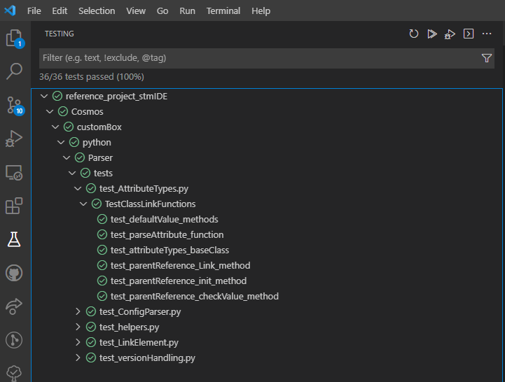
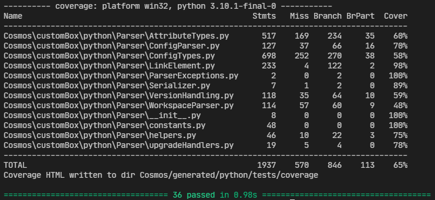
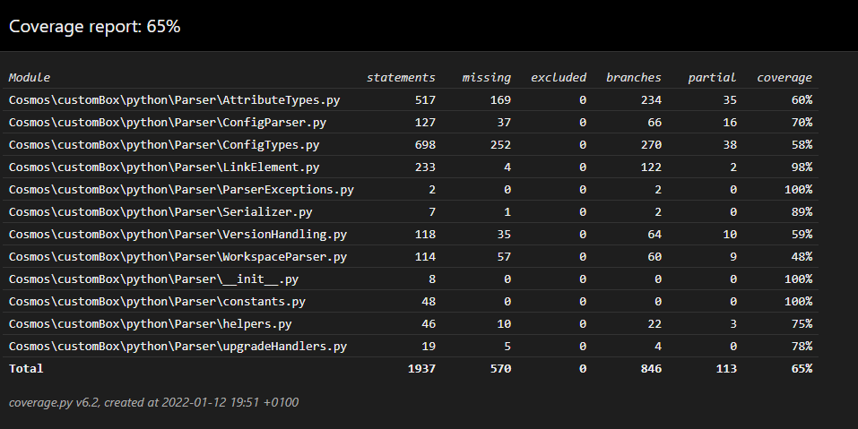

Run tests
=============================
Currently it is easy to run tests from the docker development environment. After cloning the reference
project the test can be executed by running the command :code:`pytest` from the project root.

Additionally by using the provided VSCode configuration and workspace the unit tests can also be run and debugged from within VSCode by using the Testing sidebar:



How to get the results and tests coverage
-------------------------------------------
Console output
`````````````````
To quickly check if your tests are passing you can use the console output. It provides to you basic output with coverage information
and the number of passed and failed test cases.



Generated result XML files
````````````````````````````
Generated XML test results contain the test suite name with the number of tests and the tests themselves with descriptions.
This files can be used in the continuous integration (CI) applications. The XML test results can be found in the directory:

- :file:`Cosmos/generated/python/tests/testResults.xml`

The structure of the XML file is shown in the
XML snippet for the Test_core suite below.

.. code-block:: XML

    <?xml version="1.0" encoding="utf-8"?>
    <testsuites>
        <testsuite name="pytest" errors="0" failures="0" skipped="0" tests="36" time="0.977" timestamp="...">
            <testcase classname="Cosmos.customBox.python.Parser.tests.test_AttributeTypes.TestClassLinkFunctions" name="test_defaultValue_methods" time="0.002" />
            <testcase classname="Cosmos.customBox.python.Parser.tests.test_AttributeTypes.TestClassLinkFunctions" name="test_parseAttribute_function" time="0.003" />
            <testcase classname="Cosmos.customBox.python.Parser.tests.test_AttributeTypes.TestClassLinkFunctions" name="test_attributeTypes_baseClass" time="0.002" />
        </testsuite>
    </testsuites>


Generated coverage HTML page
```````````````````````````````
To check the code coverage pytest-cov also generates an HTML page. Its index can be found here:

- :file:`Cosmos/generated/python/tests/coverage/index.html`

The structure of the HTML page is shown in the picture below.


