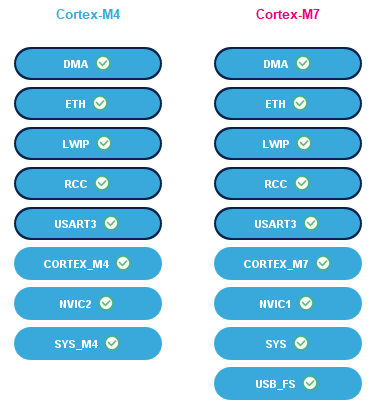
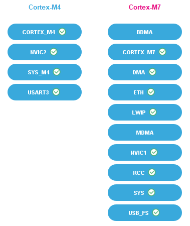
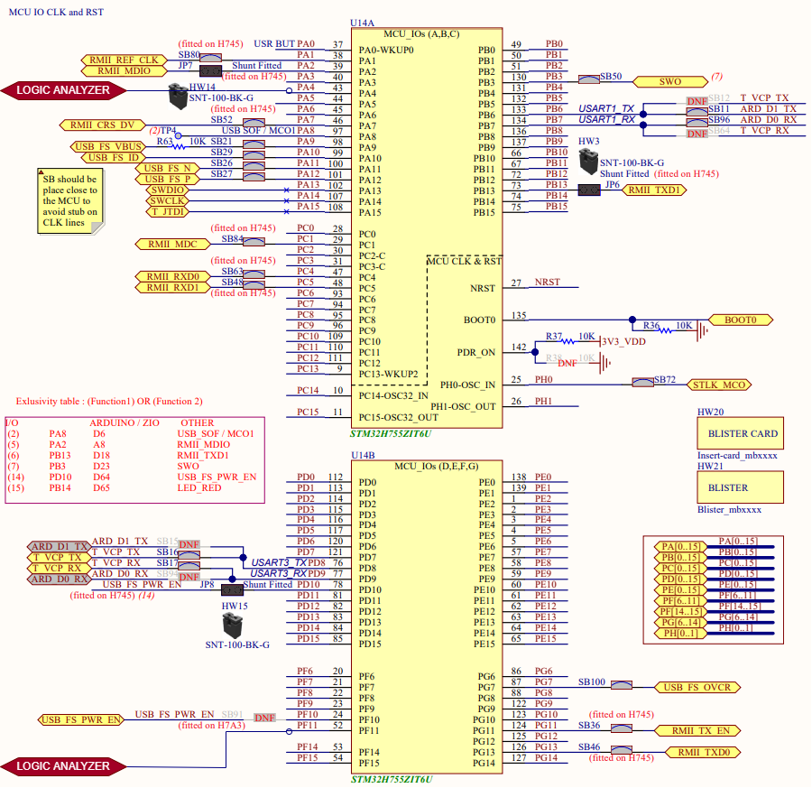

Configuration
=============================
This page will provide necessary information about the reference hardware and software configuration.
We tried to keep the hardware dependencies at minimum to be able to change the
reference hardware if necessary. For the testing and demo purposes we currently use
just few peripherals described in more details below.

Basic operating system information:
-------------------------------------
- Operating system is configured to run on the both cores (Cortex-M4 and Cortex-M7) and it is mapped to the shared memory, but executable for the each core is compiled separately to be able use the STM32 IDE project structure.
- Boot of the operating system memory section is done by the Cortex-M7 core.
- R9 register is used as a platform register for the both cores (Cortex-M4 and Cortex-M7) and stores the specific core configuration structure address.
- Memory protection is activated for the both cores and our mapping python logic runner is configured for the ARMv7 architecture together with the GNU linker scripts separate for each core.
- To access data mapped to the shared memory, we need to keep data address of the data mapped to the shared memory consistent between the both cores (this is done by generating linker scripts from the model description).
- SysTick is on both cores used as the operating system timer.
- PendSV is used as the context switch interrupt routine triggered in the sysTick ISR or independent software.
- SuperVirsor Call (SVC) is used as a system call interrupt routine.
- Set event (SEV) interrupt routine is used in the operating system event handling.
- Hardware semaphore (HSEM) feature is used in the synchronization primitives that can be used inter-core (spinlocks and semaphores).

Basic peripherals information:
---------------------------------
- Both cores are running at frequency 100 MHz using external STLINK oscillator.
- Cortex-M7 uses data and instruction cache.
- Ethernet is configured to use LWIP stack provided by the STM32 IDE and static IP.
- The USART3 is configured to the STLINK micro USB B connector with frequency 115200 Bits/s.
- The DMA is used for the USART3 and Ethernet.
- GPIO is configured to provide specific output for the logic analyzer used for the timing measurements.

Context of the configured peripherals
```````````````````````````````````````


Initialization context of the peripherals
```````````````````````````````````````````


Peripherals configuration details:
-------------------------------------
NVIC
`````````
As the ARMv7 supports nesting of the interrupts, we had to configure the correct priority group for each of the operating system interrupts. Currently
we use five priority groups where 0 is the highest and 4 is the lowest priority group.
This list provides the configured priorities for the used interrupts by the operating system:

- SysTick is assigned to the highest priority group - 0 because it handles the WCET exceeding by critical tasks.
- SVC (system calls) is assigned to the priority group - 1 to not to block sysTick but finish all the operations before the schedulable is preempted eventually (threads).
- SEV (operating system events) is assigned to the priority group - 2 to not to block sysTick and system calls but finish all the operations before the schedulable is preempted eventually (threads).
- PendSV (context switch) is assigned to the lowest priority group - 4 to not block any other interrupts in the system, because the context switch would fail.

SysTick
`````````
System timer for the both cores (Cortex-M4 and Cortex-M7) is running with frequency 100 MHz. The load register
value is not constant when the classic or hybrid scheduling. This is experimental configuration and should not
be used like this. We are working on the more safe solution system timer peripheral IP developed on the FPGA
that should be released with the Live release and provide necessary hardware support for our scheduling.

Memory protection unit
````````````````````````
For the operating system we are using currently eight protected memory regions. The main constrain for the
memory region is the Cortex-M4 core that offers only eight configurable MPU regions.
This is the list of the used memory regions with description:

#. Flash memory region read-only protected for the privileged and user access.
    - shareable
    - cachable
    - not bufferable
    - contiguous and aligned start address and size of the memory region, done by the memory mapping python logic runner

#. Stack memory region read-write for the privileged and read-only protected for the user access.
    - shareable
    - cachable
    - not bufferable
    - contiguous and aligned start address and size of the memory region, done by the memory mapping python logic runner


#. OS constant memory region read-only protected for the privileged and user access.
    - shareable
    - cachable
    - not bufferable
    - contiguous and aligned start address and size of the memory region, done by the memory mapping python logic runner


#. OS variable memory region read-write for the privileged and read-only protected for the user access.
    - shareable
    - not cachable
    - not bufferable
    - contiguous and aligned start address and size of the memory region, done by the memory mapping python logic runner


#. Unprotected memory region full access.
    - shareable
    - cachable
    - not bufferable
    - contiguous and aligned start address and size of the memory region, done by the memory mapping python logic runner


#. Schedulable peripheral run-time window memory region full access.
    - shareable
    - not cachable
    - bufferable
    - contiguous and aligned start address and size of the memory region, done by the memory mapping python logic runner


#. Schedulable program memory run-time window memory region full access.
    - shareable
    - cachable
    - not bufferable
    - contiguous and aligned start address and size of the memory region, done by the memory mapping python logic runner


#. Schedulable stack memory run-time window memory region full access.
    - shareable
    - cachable
    - not bufferable
    - contiguous and aligned start address and size of the memory region, done by the memory mapping python logic runner


Instruction and data cache
```````````````````````````
Cortex-M7 has implemented instruction and data cache. The cached data is constrained by the MPU regions explained
in the MPU peripheral chapter. Instead of invalidating cache we are not allowing caching some memory regions which might
be accessed by the multiple MCU masters and contain variable data.

HSEM
```````
The reference hardware offers 32 hardware semaphores which are used for the inter-core synchronization primitives.
We had to therefore split these hardware semaphores for the spinlocks from the 0-15 and for the semaphores from 16-31.
With this hack we are able to configure 16 spinlocks and 16 semaphores in the operating system. The multicore architrecture
based on the ARMv7 also can offer the global monitor that would not constrain us as the hardware semaphores and we
implemented already the example code in the integration layer
`spinlock unit <https://github.com/CosmOS-Creators/stm32h755_integration_HAL/blob/master/CIL/src/CILspinlock.c#L178>`_ that can be eventually used.

GPIO
```````
We use general-purpose input/output pins to perform some of the timing measurements, for instance critical task scheduling measurements
with the digital logic analyzer. We currently use:
- Pin PA4 for the Cortex-M4 with the maximum output speed very high.
- Pin PF11 for the Cortex-M7 with the maximum output speed very high.

Following schematic shows where can be the digital analyzer probes connected.



USART3
```````
USART3 is used in the logger program. It is demo program that shows how the logger which can be used in the critical tasks as well as in threads
is implemented. The USART3 configuration is following:

- Baud rate 115200 Bits/s
- Word length 8 Bits
- None parity
- Stop bits 1
- DMA triggered data transfers

Ethernet and LWIP
``````````````````
Ethernet peripheral is used by the LWIP stack. Currently the example ethernet program contains the TCP echo thread.
The ethernet buffers and descriptors together with the LWIP memory pools have special memory protection regions configured
which are not mentioned in the MPU configuration because they are not directly OS related. They can be found in the STM32 IDE
Cortex-M7 configuration.

Ethernet configuration is following:

- Ethernet MAC address 00:80:E1:00:00:00
- Tx Descriptor Length 4
- First Tx Descriptor Address 0x30040060
- Rx Descriptor Length 4
- First Rx Descriptor Address 0x30040000
- Rx Buffers Address 0x30040200
- Rx Buffers Length 1524

LWIP configuration is following (please reconfigure IP address parameters if they do not fit your local network configuration):

- Static IP address 192.168.001.030
- Netmask Address 255.255.255.000
- Gateway Address 192.168.001.001
- PHY Driver LAN8742
- Heap memory size 10K Bytes
- Heap memory address 0x30044000

DMA
```````
DMA has currently configured just the USART3 TX and Ethernet peripherals data streams.
